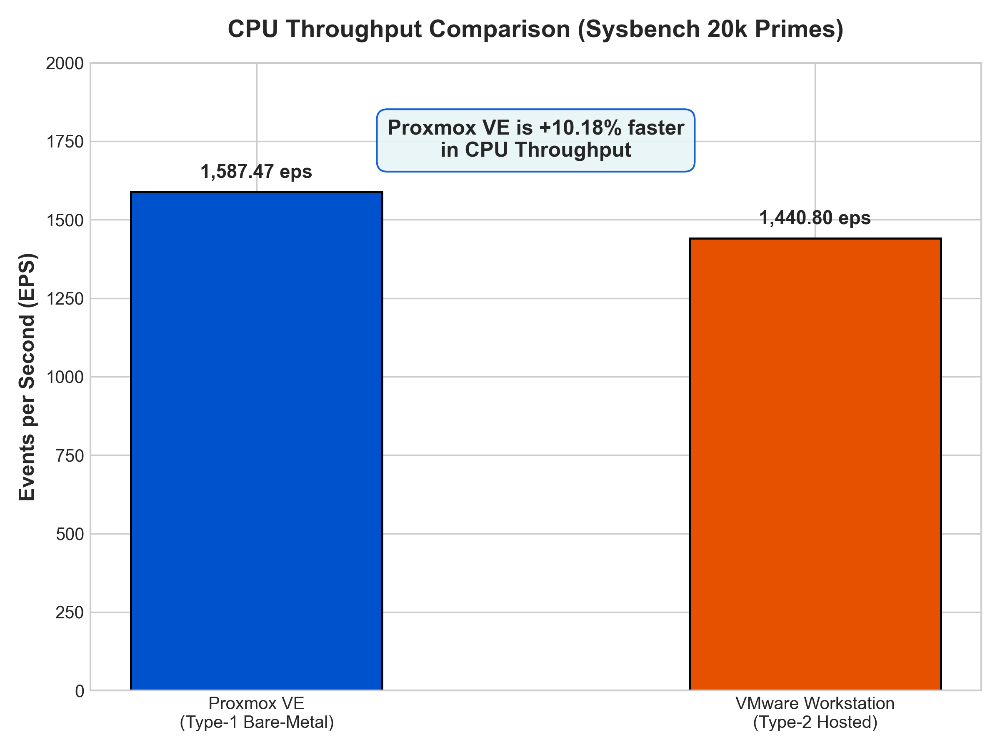
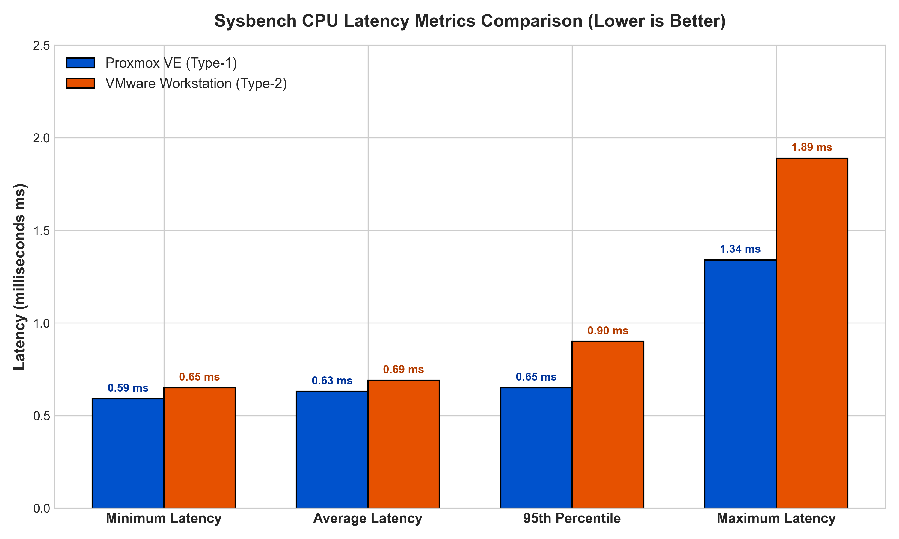
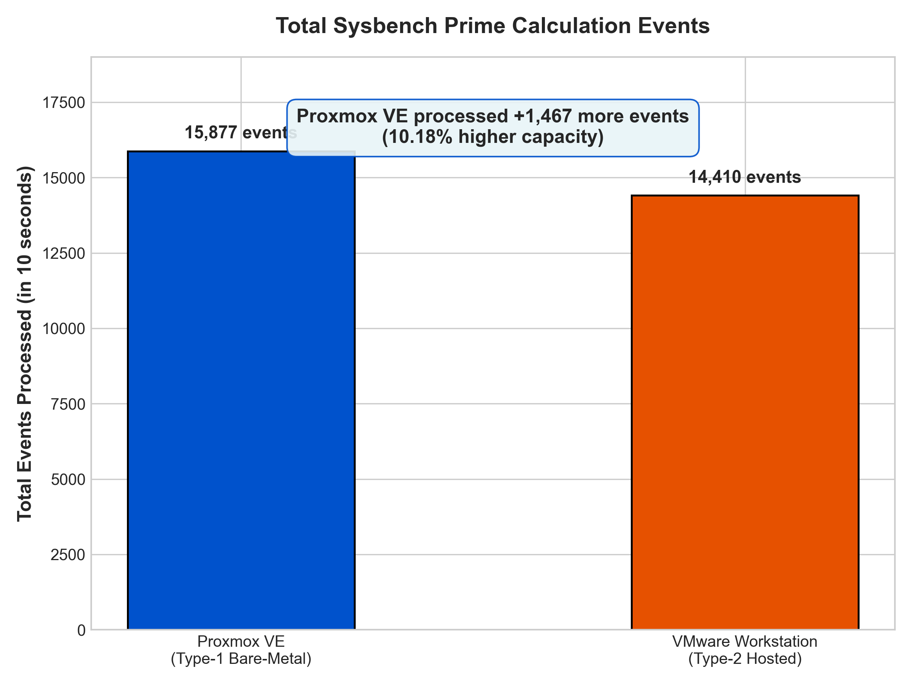
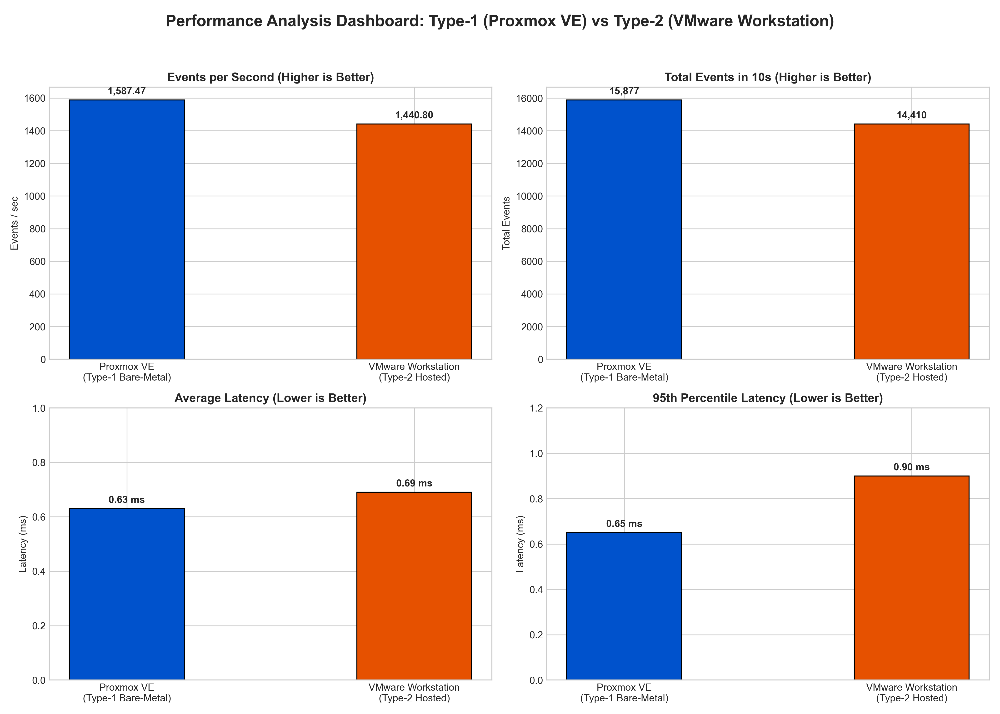

# LABORATORY REPORT
## Performance Analysis of Type-1 and Type-2 Hypervisors

**Course Title:** Cloud Computing / Computer Networks Laboratory  
**Experiment No:** 1  
**Topic:** Comparative CPU Performance Evaluation of Proxmox VE (Type-1) and VMware Workstation (Type-2) Hypervisors  

**Student Details:**  
- **Name:** Nupur Bagave  
- **USN:** 01FE24BCI029  
- **Division:** A  
- **Roll No:** 125  

---

## 1. Objective of the Experiment

The objective of this laboratory experiment is to:
1. Deploy two identically configured Ubuntu Virtual Machines on two distinct hypervisor architectures:
   - **Type-1 Hypervisor**: Proxmox VE (Bare-metal)
   - **Type-2 Hypervisor**: VMware Workstation (Hosted)
2. Execute a CPU computational benchmark using `sysbench` (`--cpu-max-prime=20000`).
3. Collect performance parameters including total execution time, total events, events per second (throughput), minimum latency, average latency, maximum latency, and 95th percentile latency.
4. Analyze the performance difference and understand the impact of hypervisor overhead and host operating system abstraction.

---

## 2. Theory & Hypervisor Classification

### 2.1 Type-1 Hypervisor (Bare-Metal Hypervisor)
A Type-1 hypervisor runs directly on the underlying physical server hardware without requiring a host operating system. 
- **Examples**: Proxmox VE (KVM), VMware ESXi, Microsoft Hyper-V (Core), Xen.
- **Architecture**:
  ```
  [ Guest Virtual Machine (Ubuntu) ]
                │
                ▼
  [ Proxmox VE Hypervisor (KVM Kernel) ]
                │
                ▼
  [ Physical Hardware (CPU, RAM, Disk) ]
  ```
- **Advantages**: Minimal virtualization overhead, direct hardware access via hardware virtualization extensions (Intel VT-x / AMD-V), high throughput, low latency, enterprise-grade scalability.

### 2.2 Type-2 Hypervisor (Hosted Hypervisor)
A Type-2 hypervisor runs as a software application on top of a conventional host operating system.
- **Examples**: VMware Workstation, Oracle VM VirtualBox, Parallels Desktop.
- **Architecture**:
  ```
  [ Guest Virtual Machine (Ubuntu) ]
                │
                ▼
  [ VMware Workstation (Hypervisor App) ]
                │
                ▼
  [ Host Operating System (Windows 11) ]
                │
                ▼
  [ Physical Hardware (CPU, RAM, Disk) ]
  ```
- **Advantages**: Easy installation, user-friendly GUI, seamless desktop integration, flexible network options.
- **Disadvantages**: Higher CPU instruction overhead, host OS resource contention, higher context switching delays.

---

## 3. Hardware & Software Specifications

### Standardized Virtual Machine Specifications
Both virtual machines were provisioned with strictly identical hardware parameter limits:

| Resource Parameter | Proxmox VE (Type-1) | VMware Workstation (Type-2) |
| :--- | :--- | :--- |
| **Virtual Machine Name** | `vm01-Standard-PC-i440FX-PIIX-1996` | `nupur-virtual-machine` |
| **Guest OS** | Ubuntu 22.04.5 LTS (x86_64) | Ubuntu 22.04.5 LTS (x86_64) |
| **Virtual CPU (vCPU)** | 2 vCPU (1 socket, 2 cores) | 2 vCPU (1 processor, 2 cores) |
| **CPU Model** | QEMU Virtual CPU version 2.5+ | 13th Gen Intel Core i5-13450HX |
| **Memory (RAM)** | 2048 MiB (2 GB) | 2048 MB (approximately 2 GB) |
| **Virtual Hard Disk** | 20 GB (VirtIO SCSI) | 20 GB (SCSI / NVMe) |
| **Network Adapter** | VirtIO Bridge (`vmbr0`) | NAT |
| **Virtualization Engine** | KVM (Full Virtualization) | VMware (Full Virtualization) |

---

## 4. Step-by-Step Experimental Procedure

### Part A: Proxmox VE (Type-1) Workflow
1. Access Proxmox VE web management console via the designated web browser address.
2. Click **Create VM** and configure the VM Name and resources.
3. Attach the Ubuntu 22.04.5 LTS ISO, set vCPU to 2 Cores, RAM to 2048 MiB, Disk to 20 GB, and configure the `vmbr0` bridge.
4. Power on the VM, complete Ubuntu installation, and verify system state:
   ```bash
   hostnamectl
   lscpu
   free -h
   df -h
   top
   ```
5. Install and run Sysbench:
   ```bash
   sudo apt update && sudo apt install sysbench -y
   sysbench cpu --cpu-max-prime=20000 run
   ```

### Part B: VMware Workstation (Type-2) Workflow
1. Launch VMware Workstation on the Windows host.
2. Select **Create a New Virtual Machine** $\rightarrow$ **Typical**.
3. Browse and select the Ubuntu 22.04.5 LTS ISO image.
4. Set the VM Name to `nupur-virtual-machine` and specify the destination path.
5. Allocate a 20 GB virtual disk, customize hardware to 2 vCPU, 2 GB RAM, and NAT network adapter.
6. Power on the VM, complete Ubuntu installation, and verify system state (`hostnamectl`, `lscpu`, `free -h`, `df -h`).
7. Install and run Sysbench:
   ```bash
   sudo apt update && sudo apt install sysbench -y
   sysbench cpu --cpu-max-prime=20000 run
   ```

---

## 5. Experimental Observations & Data Collection

### Primary Benchmark Outputs

#### 1. Proxmox VE (Type-1 Hypervisor) Output:
```text
vm01@vm01-Standard-PC-i440FX-PIIX-1996:~$ sysbench --version
sysbench 1.0.20
vm01@vm01-Standard-PC-i440FX-PIIX-1996:~$ sysbench cpu --cpu-max-prime=20000 run
sysbench 1.0.20 (using system LuaJIT 2.1.0-beta3)

Running the test with following options:
Number of threads: 1
Initializing random number generator from current time

Prime numbers limit: 20000

Initializing worker threads...

Threads started!

CPU speed:
    events per second: 1587.47

General statistics:
    total time:                          10.0005s
    total number of events:              15877

Latency (ms):
         min:                                    0.59
         avg:                                    0.63
         max:                                    1.34
         95th percentile:                        0.65
         sum:                                 9996.82

Threads fairness:
    events (avg/stddev):           15877.0000/0.00
    execution time (avg/stddev):   9.9968/0.00
```

#### 2. VMware Workstation (Type-2 Hypervisor) Output:
```text
nupur@nupur-virtual-machine:~$ sysbench --version
sysbench 1.0.20
nupur@nupur-virtual-machine:~$ sysbench cpu --cpu-max-prime=20000 run
sysbench 1.0.20 (using system LuaJIT 2.1.0-beta3)

Running the test with following options:
Number of threads: 1
Initializing random number generator from current time

Prime numbers limit: 20000

Initializing worker threads...

Threads started!

CPU speed:
    events per second: 1440.80

General statistics:
    total time:                          10.0004s
    total number of events:              14410

Latency (ms):
         min:                                    0.65
         avg:                                    0.69
         max:                                    1.89
         95th percentile:                        0.90
         sum:                                 9994.20

Threads fairness:
    events (avg/stddev):           14410.0000/0.00
    execution time (avg/stddev):   9.9942/0.00
```

---

## 6. Consolidated Performance Comparison Table

| Performance Metric | Proxmox VE (Type-1) | VMware Workstation (Type-2) | Difference / Delta | Remarks |
| :--- | :---: | :---: | :---: | :--- |
| **Total Execution Time** | **10.0005 s** | **10.0004 s** | 0.0001 s | Standard 10-second test window |
| **Total Events Processed** | **15,877** | **14,410** | **+1,467 events** | **Proxmox VE +10.18% capacity** |
| **Events per Second (EPS)**| **1,587.47** | **1,440.80** | **+146.67 eps** | **Proxmox VE +10.18% throughput** |
| **Minimum Latency** | **0.59 ms** | **0.65 ms** | **-0.06 ms** | **Proxmox VE 9.23% lower** |
| **Average Latency** | **0.63 ms** | **0.69 ms** | **-0.06 ms** | **Proxmox VE 8.70% lower** |
| **95th Percentile Latency**| **0.65 ms** | **0.90 ms** | **-0.25 ms** | **Proxmox VE 27.78% lower** |
| **Maximum Latency** | **1.34 ms** | **1.89 ms** | **-0.55 ms** | **Proxmox VE 29.10% lower** |

---

## 7. Performance Visualization

### Figure 1: CPU Throughput (Events/sec)


### Figure 2: Latency Distribution Comparison


### Figure 3: Total Events Processed


### Figure 4: Overall Performance Dashboard


---

## 8. Technical Analysis & Discussion

### 8.1 Throughput Analysis
The test measures how many prime calculations can be completed in 10 seconds. Proxmox VE completed 15,877 events (1,587.47 events/sec), while VMware Workstation completed 14,410 events (1,440.80 events/sec).
- **Percentage Improvement**:
  $$\text{Improvement} = \frac{1587.47 - 1440.80}{1440.80} \times 100\% = 10.18\%$$

### 8.2 Latency & Overhead Analysis
- **Average Latency**: Proxmox VE averaged 0.63 ms per event, whereas VMware Workstation averaged 0.69 ms (+0.06 ms overhead, an 8.70% difference).
- **Consistency**: Proxmox VE demonstrated significantly superior latency consistency at higher percentiles:
  - 95th Percentile Latency: **0.65 ms** on Proxmox VE vs **0.90 ms** on VMware Workstation (27.78% lower).
  - Maximum Latency: **1.34 ms** on Proxmox VE vs **1.89 ms** on VMware Workstation (29.10% lower).
- **Root Cause**:
  1. **Host OS Context Switches**: In Type-2 hypervisors, CPU requests pass through Windows OS process scheduling, adding latency and jitter.
  2. **Privileged Mode Transitions**: Proxmox VE leverages KVM direct Ring 0 execution, bypassing intermediate guest-to-host system calls.

---

## 9. Conclusion

1. **Type-1 hypervisors (Proxmox VE)** provide superior CPU performance (~10.18% higher throughput, ~8.70% lower average latency, and ~27.78% lower 95th percentile latency) compared to Type-2 hypervisors (VMware Workstation).
2. The extra abstraction layer and host OS resource overhead in Type-2 hypervisors visibly degrade CPU benchmark metrics and introduce latency variance.
3. **Engineering Recommendation**: Use Type-1 hypervisors for production cloud infrastructure and Type-2 hypervisors for local development and testing environments.

---
**Student Signature:** Nupur Bagave  
**USN:** 01FE24BCI029  
**Division:** A | **Roll No:** 125  
**Date of Submission:** September 24, 2026  
**Evaluation Grade:** ________ / ________
